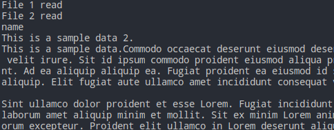
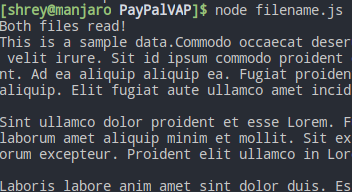
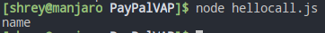
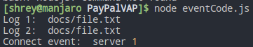

# PayPal VAP on REST API | NodeJS

## Day 1 | Functions, Files &amp; modules
[filename.js](filename.js)

```js
var fs = require("fs");

filename1 = "file1.txt";
filename2 = "file2.txt";


fs.readFile(filename1, function (err, data) {
	console.log(data.toString());
});

console.log("File 1 read");

fs.readFile(filename2, function (err, data) {
	console.log(data.toString());
});

console.log("File 2 read");
```

The above code uses **fs** library to read and write files. In the above code there is one issue, the files are read and written out of sequence as javascript runs functions _asynchronously_.



To fix that, the following snippet can be used.

```js
var a = 0;
var data1;
var data2;
function onComplete(){
  if(a==2){
		console.log("Both files read!");
		console.log(data1);
		console.log(data2);
  }
}

fs.readFile(filename1, function (err, data) {
  data1 = data.toString();
  a+=1;
  onComplete();
});

fs.readFile(filename2, function (err, data) {
  data2=data.toString();
  a+=1;
  onComplete();
});
```

This code snippet ensures that both files are read and only then processing on them is done by using _onComplete_ function.



#### Command line arguments
You can pass command line arguments to javascript as follows:
```js
var fs = require("fs");
fs.readFile(process.argv[2], function(err, data){
	console.log(data.toString());
});
```

## Module.exports
We can export functions, variables as well as objects by using *module.exports*.

[hello.js](hello.js)
```js
function hello(name){
	console.log(name);
}

module.exports = {functionName: hello, param: "name"};

```

[hellocall.js](hellocall.js)
```js
const {functionName, param} = require("./hello");

functionName(param);
```


## Day 2 &amp; 3 | Events, lodash and http

Similar to what we did above by _onComplete_ function, javascript has events which can be used to signal different functions to tell them when a particular function has completed execution.

```js
var eventEmitter = new events.EventEmitter();

eventEmitter.on('read', (file)=>{
	console.log("Log 1: ", file);
});

eventEmitter.on('read', (file)=>{
	console.log("Log 2: ", file);
});

eventEmitter.on('connect', (file, serverID)=>{
	console.log("Connect event: ", file, serverID);
});

eventEmitter.emit('read', 'docs/file.txt');
eventEmitter.emit('connect', 'server', 1);
```

All of these are custom implementation of eventEmitter. We attach a *listener* by using `eventEmitter.on` function and then defining an **event**. In the above case the events are *read and connect*.

We also emit two events, *read and connect* by using the `eventEmitter.emit` function. `eventEmitter.emit` accepts two parameters, first is **event** to emit and then the **function parameters**.

We can also attach multiple listeners to same event as seen above for Log1 nd Log2.



```js
let readStream = fs.createReadStream("airports.csv", 'utf-8');
var data="";
var i =1;

readStream.on("data", function(chunk){
	data+=chunk;
	console.log("Chunk: "+i);
	i+=1;
}).on("end", function(){
	console.log("Completed");
});
```

Some javascript functions such as `fs.createReadStream` generate events to which we can attach listeners to. We can also chain events as we did above for `.on("data", ...)` and `on("end", ...)`.

### Lodash
[airport.js](airport.js)
Some of the functions in lodash are:
  - union
  - filter
  - uniqWith
  - uniqBy
  - intersectionBy
  - sortedUniqBy

Some of these features are implemented to extract data from *airport.csv*.

[search.js](search.js)
[process.js](process.js)
```js
function searchByAirportName(data, name){
	return _.filter(data, (value)=>{
		return value[1].toLowerCase() == name.toLowerCase();
	});
}

function searchByCityName(data, name){
	return _.filter(data, (value)=>{
		return value[2].toLowerCase() == name.toLowerCase();
	});
}

function countDistinct(data, column){
	return _.uniqBy(data, column).length;
}
```

### Making server using HTTP
The server reads *airports.csv* and return the following data on the respective routes:
|Route				|Data													|
|-------------|----------------------------:|
|/cities			|Returns all cities						|
|/airports		|Returns all airports					|
|/cities/:id	|Returns city details by id		|

[indexAirports.js](indexAirports.js)
```js

var server = http.createServer(function (req, res) {
	// To render JSON in firefox by default
	res.setHeader("Content-Type", "application/json");

	eventEmitter.on('complete', function (data) {
		return res.end(JSON.stringify({data}));
	});

	if (req.url == "/airport") {
		fs.readFile("./airports.csv", function (err, data) {
			airports = getColumnn(data, 1);
			 eventEmitter.emit('complete', airports);
		});
	}
	else if (req.url == "/cities") {
		fs.readFile("./airports.csv", function (err, data) {
			cities = getColumnn(data, 2);
			return eventEmitter.emit('complete', cities);
		});
	}
	else if (/cities\/[a-zA-Z]*$/.test(req.url)) {
		fs.readFile("./airports.csv", function (err, data) {
			let city = /[a-zA-Z]*$/.exec(req.url)[0];
			let details = searchByCityName(parseAndClean(dataToArray(data)), city)

			return eventEmitter.emit('complete', details);
		});
	}
	else {
		res.end("Invalid path");
	}
});

server.listen(8000, function(){
	console.log("Server running");
});
```

Let's go over the code function by function:

```js
eventEmitter.on('complete', function (data) {
		return res.end(JSON.stringify({data}));
	});
```
Event listener to be executed when *complete* event is emitted.

```js
if (req.url == "/airport") {
		fs.readFile("./airports.csv", function (err, data) {
			airports = getColumnn(data, 1);
			 eventEmitter.emit('complete', airports);
		});
	}
	else if (req.url == "/cities") {
		fs.readFile("./airports.csv", function (err, data) {
			cities = getColumnn(data, 2);
			return eventEmitter.emit('complete', cities);
		});
	}
	else if (/cities\/[a-zA-Z]*$/.test(req.url)) {
		fs.readFile("./airports.csv", function (err, data) {
			let city = /[a-zA-Z]*$/.exec(req.url)[0];
			let details = searchByCityName(parseAndClean(dataToArray(data)), city)

			return eventEmitter.emit('complete', details);
		});
	}
	else {
		res.end("Invalid path");
	}
});
```
The routes are implemented by using **if-else** statements, the last route is implemented using regex. The city/:id is also extracted with the help of regex.

Once each route is complete they emit the *complete* event and the data. This ensures that the data is read completely before sending it to the client.

Final we have:
```js
server.listen(8000, function(){
	console.log("Server running");
});
```
which sets the server to listen on port 8000.

## Day 4 | Express, middleware and PUG
