# CReg | Paypal midterm project

> Creg is a Course Registration app made for professors and students. Any user can sign-up as a professor or students. Professors can create courses at particular slots to which students can register themselves.

### Setup
`npm install`

### Start Server
`npm start`

The server runs on port 3000 which can be changes in [app.js](app.js)

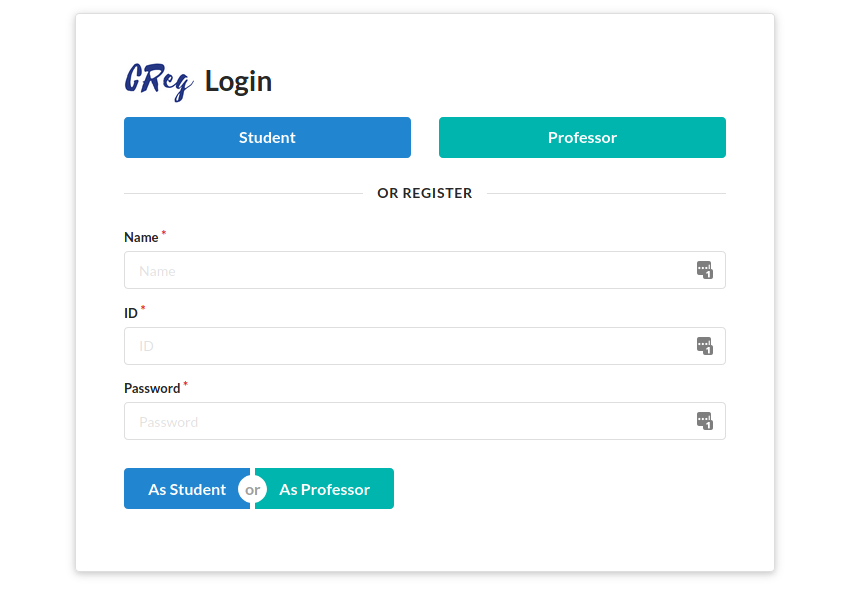

## Data description
  - Student
    - _id
    - username
    - password
    - name
    - courses
    - type
    - createdOn
  - Professor
    - _id
    - username
    - password
    - name
    - courses
    - type
    - createdOn
  - Course
    - _id
    - courseID
    - name
    - slot
    - students
    - professor

# Routes

These are the routes implemented in the application:

Route | Method | Name
------|--------|-----
/ | GET | Root Route
/register|POST| Signup Route
/login/professor|GET|Professor Login Page
/login/professor|POST|Professor Login POST
/logout|GET|Logout Route
/professor|GET|Professor Dashboard
/login/student|GET|Student Login Page
/login/student|POST|Student Login POST
/student|GET|Student Dashboard
/course/register|GET|Course Registration
/course/register/:courseID/:professorID|GET|Register new course
/course/drop/:courseID|GET|Drop course
/course/create|GET|Create Course Page
/course/create|POST|Create new course
/course/delete/:courseID|GET|De-register Course

# Description of Routes
## Root Route
Path: `/`

Method: `GET`

This is the main route which contains the login and registraion page.

[index.pug](views/index.pug)


A single page is used signup both professors and students.

Code:
```javascript
router.get("/", function (req, res) {
  let registerError = req.query.regError;
  res.render("index", {
    registerError,
  });
});
```

The index page can show error messages by using `req.params`.

Sample Error
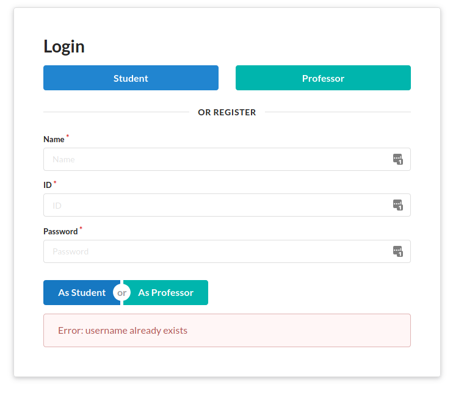


The homepage as well as the backend has form validation.
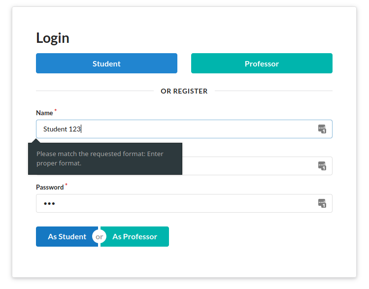


## Professor Login Page & Student Login Page

Path: `/login/professor`

Path: `/login/student`

Method: `GET`

The professor &amp; student login looks similar and have same functionalities.

[login.pug](views/login.pug)
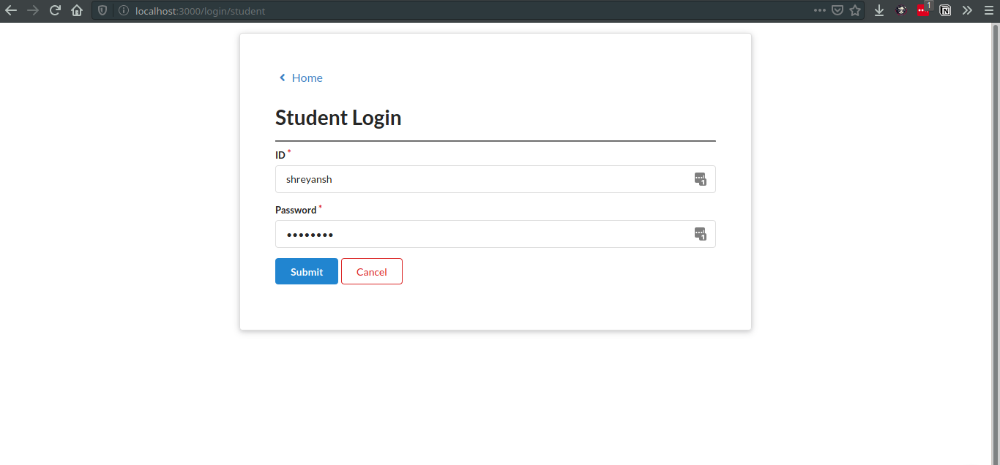

## Professor Login POST & Student Login POST

Path: `/login/professor`

Path: `/login/student`

Method: `POST`

[student.js](student.js)
```javascript
router.post("/login/student", function (req, res) {
  authenticateStudent(escape(req.body.username), hashPassword(req.body.password))
    .then(async (userDetails) => {
      console.log(userDetails);
      userDetails.courseDetails = [];
      userDetails.course=[];
      // Fill Course Details
      for (let i = 0; i < userDetails.courses.length; i++) {
        let course = await searchFile("./data/course.dat", userDetails.courses[i], '_id');
        userDetails.course.push(course._id);
        course.professorDetails = await searchFile("./data/professor.dat", course.professor, '_id')
        userDetails.courseDetails.push(course);
      }
      userDetails.slots = await getSlots(userDetails.courses);
      req.session.user = userDetails;
      res.redirect("/student");
    })
    .catch((err) => {
      errorPrint(err.stack);
      return res.redirect(url.format({
        pathname:"/",
        query: {
          "regError": err.message,
        },
      }));
    })
});
```

This route is responsible to login a user. The following things are done by this route:

1. Call authenticateStudent which verifies the credentials from files.
2. Asynchronously read the courses for that student as well the professor details
3. Store this user object in `req.session` which is used to maintain a session across all routes.
4. In case of error, log the error to console using our `errorPrint` function and then redirect to **Root Route**.
5. If everything is okay then render the dashboard.

## Professor Dashboard
[professor.pug](views/professor.pug)

Sample Profile first tab with Message Alert
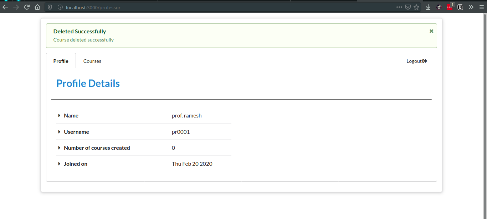
Path: `/login/student`

Method: `GET`

The professor dashboard has two tabs:
  - Profile: Shows all the profile details
  - Courses: Shows all the created courses

Additionally it also has a logout option.


### Course Tab
[professor/courses.pug](views/professor/courses.pug)
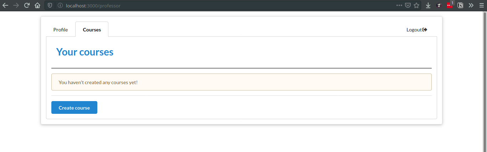

When no courses are created by a professor, this tab is seen via which they can create new courses.


## Create Course Page
Path: `/course/create`

Method: `GET`

When a **professor** clicks on create course they are redirected to this page. The functionalities on this dashboard is:
  - View self profile
  - Create new course
  - View all created course
  - De-register a course

**Registration page with sample course and slot**

[createCourse.pug](views/createCourse.pug)
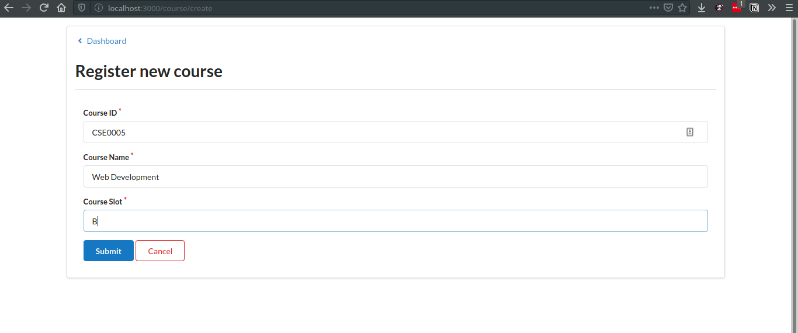

Once they click on `Submit`, the data is submitted to `/course/create` as `POST`.

## Create new course
Path: `/course/create`

Method: `POST`

The POST route has the following parts:

1. Checking &amp; Validating Data

[professor.js -> createcourse(...)](professor.js)
```javascript
  if (!professorObj || !courseObj)
    throw new Error("All params required!");

  if (!professorObj._id)
    throw new Error("Professor obj missing _id!");

  if (
    !courseObj.courseID ||
    !courseObj.name ||
    !courseObj.slot
  )
    throw new Error("CourseObj missing required properties");


  if (!/^[A-Za-z]{3}[0-9]{4}$/.test(courseObj.courseID))
    throw new Error("Invalid courseID format");

  if (["A", "B", "C", "D", "E", "F"].indexOf(courseObj.slot) < 0)
    throw new Error(

...
```
2. Cloning the object (pass by value) and updating properties

```javascript
  // clone the object
  professorObj = {
    "username": professorObj.username,
    "name": professorObj.name,
    "password": professorObj.password,
    "courses": professorObj.courses,
    "type": professorObj.type,
    "_id": professorObj._id,
    "createdOn":professorObj.createdOn,
  }

  courseObj.students = [];
  courseObj.professor = professorObj._id;
```

3. Adding new course to file and updating professor data (both session and in file)

```javascript
  return addToFile("./data/course.dat", JSON.stringify(courseObj))
    .then((newCourseObj) => {
      professorObj['courses'].push(newCourseObj['_id']);
      updateData("./data/professor.dat", JSON.stringify(professorObj))
      return newCourseObj;
    })

```

`addToFile` is a promise which is returned by the function `createCourse`.

Once a course is created professors can view the course on their dashboard.

**The course we registered is on the dashboard.**
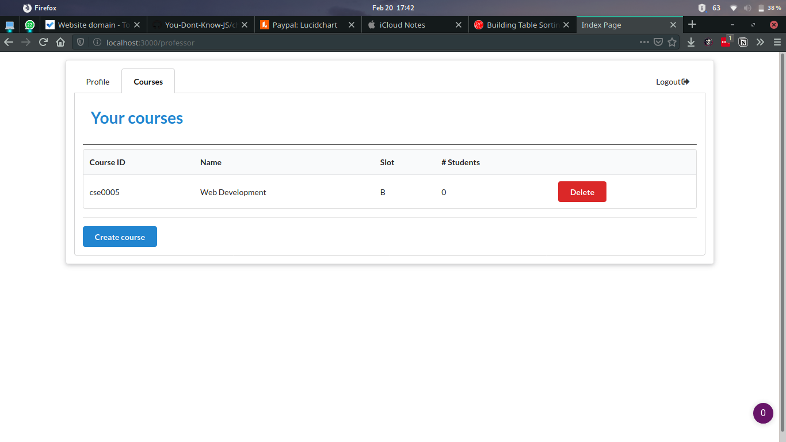

## Student Dashboard

path: `/student`

Method: `/GET`

Similar to the professor dashboard, the students also have a dashboard with more functionalities. The functionalities are:

  - View self profile
  - Register for a course
    - View all courses
    - Sort the courses
    - Search course by course ID
  - Drop a course

**Student Dashboard**
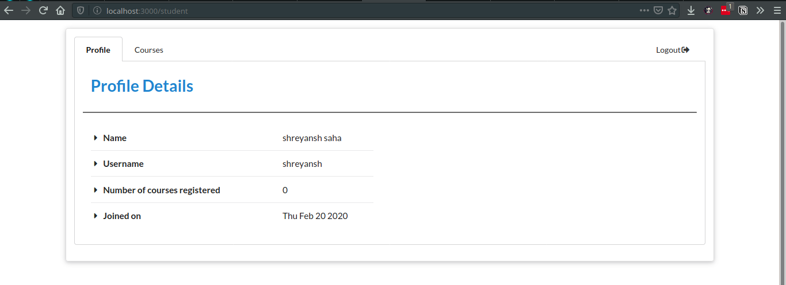

**Empty student courses**
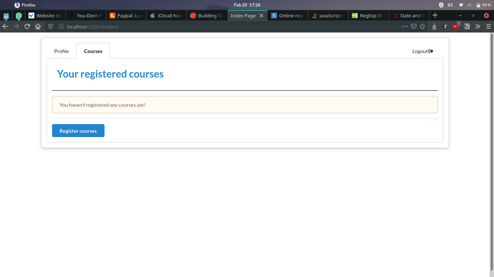

The student can click on Register Courses to register for a course.

## Course Registration
Path: `/course/register`

Method: `GET`

[course.pug](views/course.pug)

**Registration page sorted by ID**
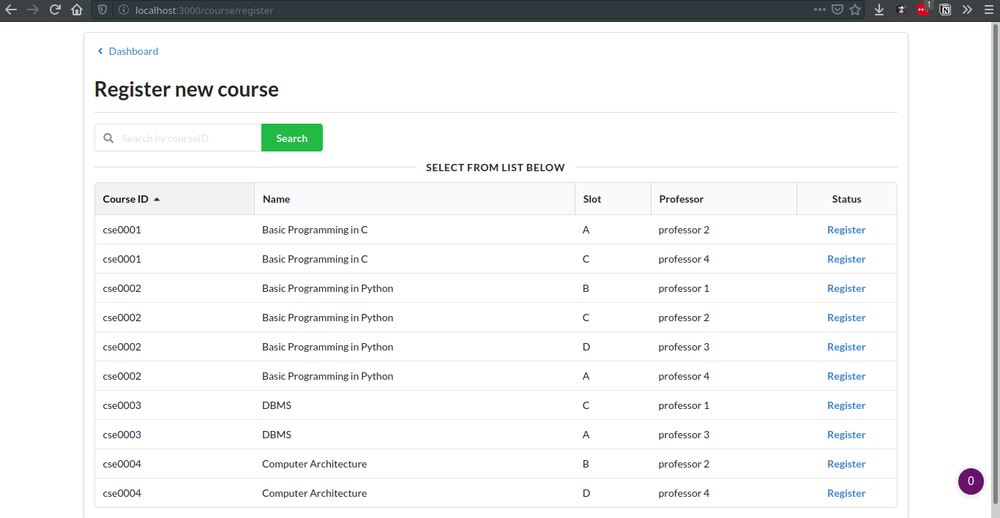

**Registration page sorted by Slot**
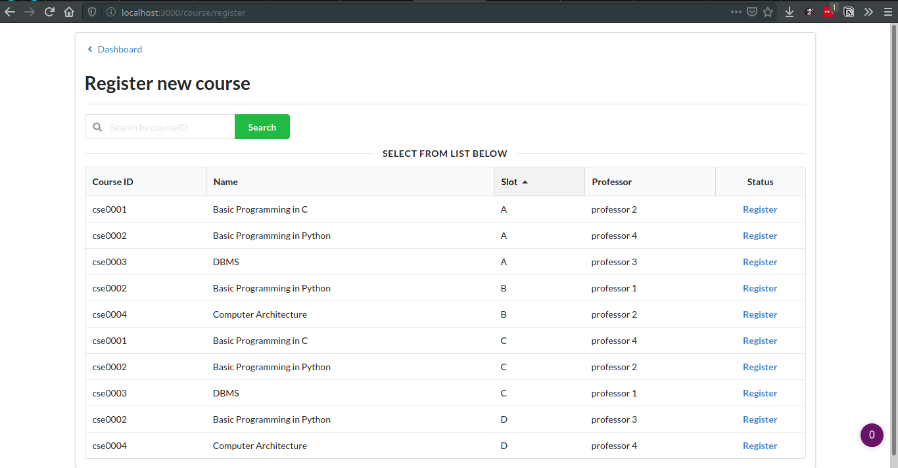

**Registration page filtered by Course ID**
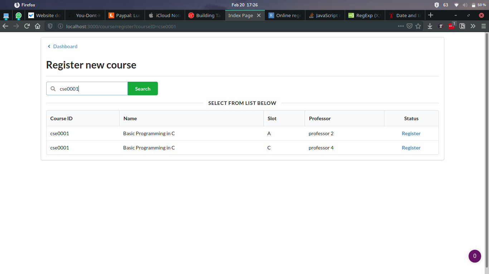

**Registration page showing clasing slots**
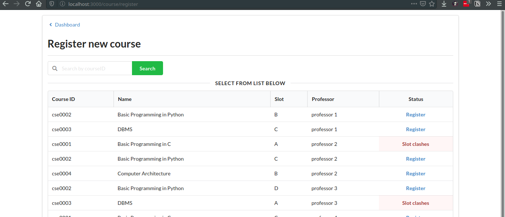

**Registration page on successful registration**
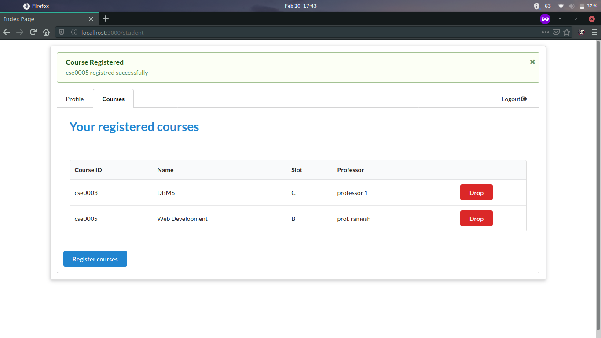

## Register new course

Path: `/course/register/:courseID/:professorID`

Method: `GET`


The route functionalities are very similar to `createCourse`. The functionalities are:
1. Validate function parameters
2. Search for `:courseID` in file
3. If found, check if student is already registered with the course OR if the slot if booked
4. If everything is clear, add student to course and add course to student in both files
5. Update session variables

[student.js -> registerCourse(...)](student.js)

```javascript
    ...
   return [newStudentObj, courseObj];
    })
    .then((combinedData) => {
      updateData("./data/student.dat", JSON.stringify(combinedData[0]));
      return combinedData[1];
    })
    .then((courseObj) => {
      updateData("./data/course.dat", JSON.stringify(courseObj), '_id')
      studentObj.slots.push(courseObj.slot);
      return courseObj;
    })
```

## Drop course
Path: `/course/drop/:courseID`

Method: `GET`

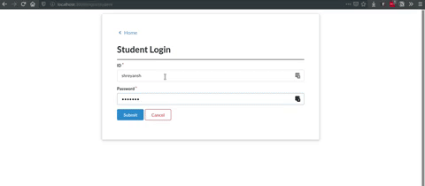

[student.js -> dropCourse(...)](student.js)

```javascript
  ...
  return searchFile("./data/course.dat", courseID, '_id')
    .then((courseObj) => {
      // remove course from student
      _.remove(newStudentObj.courses, (element) => {
        return element == courseID;
      });

      // remove student from course
      _.remove(newStudentObj.students, (element) => {
        return element == studentObj._id;
      });

      return [newStudentObj, courseObj];
    })

    .then(async (objList) => {
      await updateData("./data/student.dat", JSON.stringify(objList[0]));
      await updateData("./data/course.dat", JSON.stringify(objList[1]))
      studentObj.courses = newStudentObj.courses;
      _.remove(studentObj.courseDetails, (element)=>{
        return element._id == courseID;
      });
      _.remove(studentObj.slots, (element)=>{
        return element == objList[1].slot;
      });
      return studentObj;
    })
    ...
```

Similar to how we added the course, we just do the reverse in the above code and return the new student object.

ADD DROPPING COURSE GIF HERE

## De-register Course
Path: `/course/delete/:courseID`

Method: `GET`

Only a professor can deregister a course, the following steps are taken to de-register a course.
1. Search for `:courseID` in file
2. Authenticate if professor is the one who created the course
3. Drop the course for all students
4. Remove course from professor
5. Delete course from file
6. Update professor in file

When a course is deregistered it is also removed from the student profile.

# Description of modules and functionalities

## File handling
[fileHandling.js](fileHandling.js)

This file contains all functions to handle 3 files:
  - courses.dat:    Contains data of all courses
  - student.dat:    Contains data of all students
  - professor.dat:  Contains data of all professors

The functions included in the file are:
  - `searchFile(filename: String, value: String, property: String, returnOne: Boolean)`
  - `addToFile(filename: String, userData: String, primaryKey: String)`
  - `updateData(filename: String, newData: String, checkProperty: String)`
  - `deleteData(filename: String, dataToDelete: String, checkProperty: String)`
  - `getDataAsArray(filename: String)`

All of these functions implement the same functionalities as if we are using a database. This makes the code modular and independent.

## Middlewares
[app.js](app.js)

[middleware.js](middleware.js)

I have implemented middlewares for the following functions:
1. If a user is logged in, redirect them to their dashboard

```js
app.use((req, res, next) => {
  if (req.session.user && req.path == "/")
    return res.redirect("/" + req.session.user.type);
  next();
});

```
2. Print url status for each url
   
```js

middleware.urlStatus = function (req, res, next) {
  infoPrint('Requested: ' + req.method + " " + req.url);
  if (req.method == "post")
    infoPrint('Data sent using post: ' + JSON.stringify(req.body));
  next();
}
```
3. Check if authenticated user is a student or professor
   
```js
middleware.isStudent = function (req, res, next) {
  if (!req.session.user)
    return res.redirect("/login/student");
  if (req.session.user.type != "student")
    return res.redirect(url.format({
      pathname: "/",
      query: {
        "regError": "User type is not a student!",
      }
    }));
  next();
}

middleware.isProfessor = function (req, res, next) {
  if (!req.session.user)
    return res.redirect("/login/professor");
  if (req.session.user.type != "professor")
    return res.redirect(url.format({
      pathname: "/",
      query: {
        "regError": "User type is not a professor!",
      }
    }));
  next();
}
```

## Lodash
Lodash is used in many places to:
1. Map objects in array
```js
  let slots = _.map(studentCourses, (element) => {
    return element.slot;
  });
```

2. Filter objects in array
```js
 let objectDetails = _.filter(dataframe, (row) => {
    return row[property] == value;
  });
```
3. Find objects in array
```js
let userDetails = _.find(studentArray, { 'username': username.toLowerCase(), 'password': password });
```
4. Remove objects from array

```js
  // remove course from student
  _.remove(newStudentObj.courses, (element) => {
    return element == courseID;
  });

  // remove student from course
  _.remove(newStudentObj.students, (element) => {
    return element == studentObj._id;
  });

```
5. To get unique objects
```
  slots = _.uniq(slots);
```

## Pug
Pug is used as the template for all files

Sample: [index.pug](views/index.pug)

## Colors.js
Colors.js is used to make custom print functions to differentiate between error logs, debug logs and information logs.

[printFunction.js](printFunction.js)
```js
var colors = require('colors/safe');

const appname = '[creg] '

function debugPrint(str){
  console.log(colors.cyan(appname+str));
}

function infoPrint(str){
  console.log(colors.bold(colors.brightGreen(appname+str)));
}

function errorPrint(err){
  error=err
  if(!(err instanceof Error))
    error = new Error(err)

  console.log(colors.red(appname+error.stack));
}

module.exports.debugPrint = debugPrint;
module.exports.errorPrint = errorPrint;
module.exports.infoPrint = infoPrint;
```

# Appendix

### Directory Structure
```
- README.md
- app.js
- package.json
- ...utilityfiles
- public/
    Contains all static files for website
- routes/
    Contains all routes for website
- views/
    Contains all pug templates
```

### Sample Data Credentials:
Password for all is: password

Professor usernames:
- p0001
- p0002
- p0003
- p0004
- pr0001
- ps0001

Student usernames:
- student1
- student2
- student3
- student4
- shreyansh
- abhishek